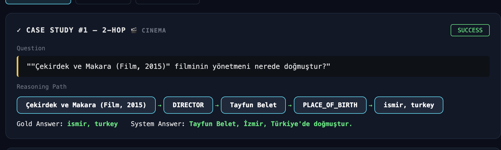
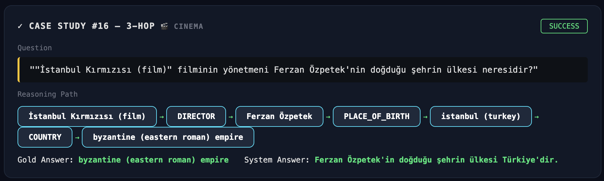
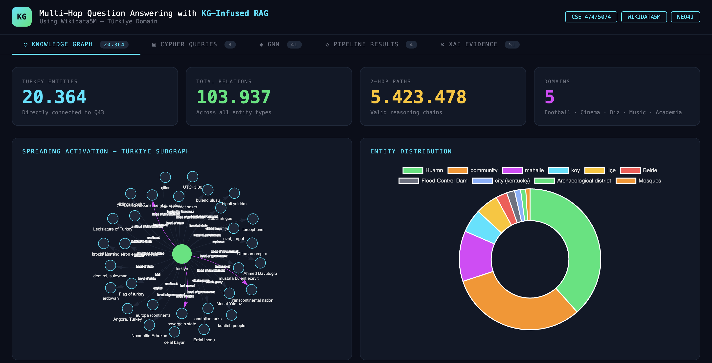
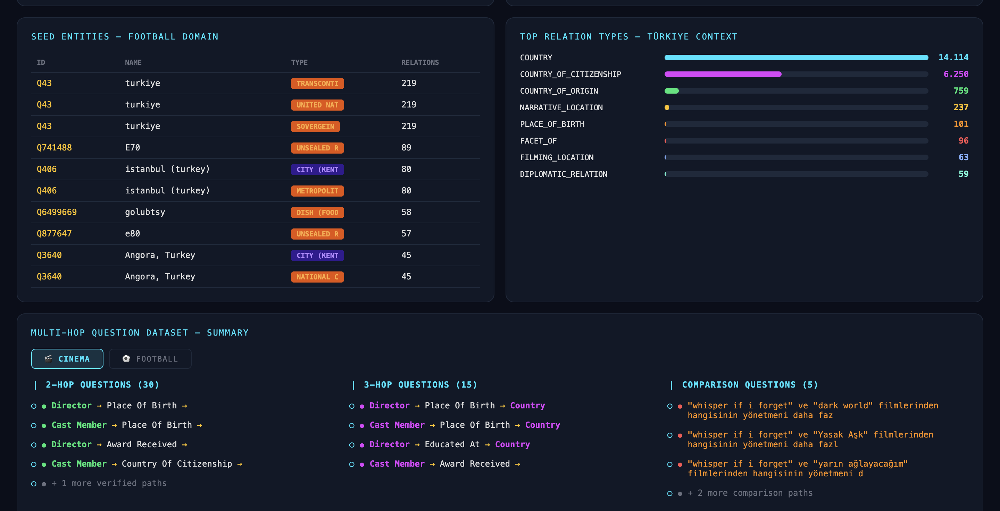
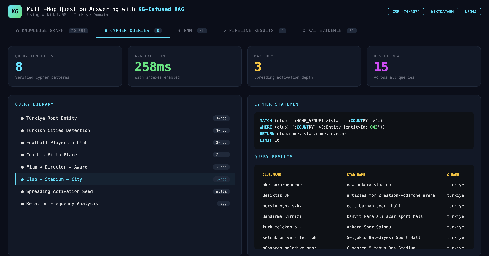

# KG-Infused RAG: Knowledge Graph Augmented Retrieval-Augmented Generation


## 📋 Table of Contents

1. [Overview](#overview)
2. [System Architecture](#system-architecture)
3. [Project Structure](#project-structure)
4. [Installation](#installation)
5. [Configuration](#configuration)
6. [Usage](#usage)
7. [Modular Pipeline](#modular-pipeline)
8. [Output & Results](#output--results)
9. [Dashboard](#dashboard)
10. [Troubleshooting](#troubleshooting)

---

## 🎯 Overview

**KG-Infused RAG** is an advanced Retrieval-Augmented Generation system that combines Knowledge Graphs with Large Language Models (LLMs) to answer domain-specific questions about **Turkey** (particularly Cinema and Football domains).

### Key Innovation

Unlike traditional RAG systems that only use keyword matching for retrieval, this system:

- **Uses Neo4j Knowledge Graph** to semantically understand entity relationships
- **Applies Spreading Activation** to gather relevant knowledge from multiple hops
- **Expands queries dynamically** using KG-guided context
- **Augments LLM answers** with structured graph knowledge
- **Evaluates quality** using accuracy, F1 score, and exact match metrics

### Domain Coverage

- **Cinema**: Turkish cinema personalities, directors, actors, films
- **Football**: Turkish football teams, players, events, venues
- **Base Knowledge**: Turkey entity relationships and hierarchies

---

## 🏗️ System Architecture

```
┌─────────────────────────────────────────────────────────┐
│                    User Question                         │
└────────────────────┬────────────────────────────────────┘
                     │
                     ▼
        ┌────────────────────────────┐
        │  Module 1: Spreading      │
        │  Activation on KG         │
        │  (Neo4j Entity Search)    │
        └────────────┬───────────────┘
                     │
                     ▼ KG Summary
        ┌────────────────────────────┐
        │  Module 2: Query           │
        │  Expansion & Wikipedia     │
        │  Retrieval                 │
        └────────────┬───────────────┘
                     │
                     ▼ Wikipedia Passages
        ┌────────────────────────────┐
        │  Module 3: KG-Augmented    │
        │  Answer Generation         │
        │  (Groq LLM)                │
        └────────────┬───────────────┘
                     │
                     ▼
             ┌───────────────────┐
             │  Final Answer     │
             │  + Confidence     │
             └───────────────────┘
```

---

## 📁 Project Structure

```
KG_RAG_Project/
│
├── requirements.txt              # Python dependencies
├── README.md                      # This file
├── .env.example                   # Environment variables template
│
├── kg_infused_rag/               # Main package
│   ├── config.py                 # Central configuration (database, LLM, parameters)
│   │
│   ├── phase1_exploration/       # Knowledge graph exploration
│   │   └── phase1_turkey_analysis.py
│   │
│   ├── phase2_domain/            # Domain-specific verification
│   │   ├── phase2_domain_overview.py
│   │   ├── phase2_cinema_verification.py
│   │   └── phase2_football_verification.py
│   │
│   ├── phase3_questions/         # QA dataset generation
│   │   ├── phase3_cinema_question_generator.py
│   │   └── phase3_football_question_generator.py
│   │
│   ├── phase4_pipeline/          # ⭐ MAIN PIPELINE (Phase 4)
│   │   ├── module1_spreading_activation.py      # KG-guided entity search
│   │   ├── module2_query_expansion.py           # Query expansion + Wikipedia retrieval
│   │   ├── module3_answer_generation.py         # LLM-based answer generation
│   │   ├── pipeline.py                          # Main orchestrator
│   │   ├── pipeline_cinema.py                   # Cinema domain pipeline
│   │   ├── pipeline_football.py                 # Football domain pipeline
│   │   └── pipeline.py.patch                    # Patch file for updates
│   │
│   ├── phase5_experiments/       # Evaluation & analysis
│   │   └── phase5_evaluation.py
│   │
│   └── phase6_case_study/        # Case study implementations
│       └── phase6_case_study.py
│
├── dashboard/                    # Web Dashboard (FastAPI)
│   ├── app.py                    # FastAPI backend
│   └── static/
│       └── index.html            # Frontend UI
│
├── outputs/                      # Generated results
│   ├── phase1_*.json             # Phase 1 analysis
│   ├── cinema/                   # Cinema domain outputs
│   │   ├── cinema_domain_report.json
│   │   ├── cinema_main_entities.json
│   │   └── ...
│   ├── football/                 # Football domain outputs
│   │   ├── football_domain_report.json
│   │   ├── football_main_entities.json
│   │   └── ...
│   ├── phase3/                   # QA datasets
│   │   └── qa_dataset.json
│   ├── phase3_football/          # Football QA dataset
│   │   └── qa_dataset.json
│   └── phase4_*/                 # Pipeline results
│       ├── pipeline_results.json
│       ├── pipeline_summary.json
│       └── single_query_result.json
│
├── wikidata5m_raw_data/          # WikiData raw data (for reference)
│   └── wikidata5m_all_triplet.txt
│
└── neo4j_data/                   # Neo4j database files (created on first run)
    └── ... (handled by Docker/Neo4j)
```

---

## 💻 Installation

### Prerequisites

- **Python 3.8+** (tested on 3.10+)
- **Neo4j** (local or Docker) — Must be running and populated with Turkish entities
- **Groq API Key** — Get from [console.groq.com](https://console.groq.com)
- **Internet connection** — For Wikipedia API calls

### Step 1: Clone/Setup Project

```bash
cd ~/Desktop/KG_RAG_Project
```

### Step 2: Create Virtual Environment

```bash
python3 -m venv venv
source venv/bin/activate  # macOS/Linux
# or: venv\Scripts\activate  # Windows
```

### Step 3: Install Dependencies

```bash
pip install --upgrade pip
pip install -r requirements.txt
```

### Step 4: Configure Environment

Create `.env` file in project root:

```env
# Neo4j Configuration
NEO4J_URI=neo4j://127.0.0.1:7687
NEO4J_USER=neo4j
NEO4J_PASSWORD=neo4j

# Groq LLM
GROQ_API_KEY=your_api_key_here

# Optional: Override defaults in config.py
# K_E=3
# MAX_ROUNDS=6
```

**Note**: Neo4j must be running with Turkish entities dataset imported. See setup guide below.

### Step 5: Verify Setup

```bash
# Test Neo4j connection
python -c "from neo4j import GraphDatabase; import os; from dotenv import load_dotenv; load_dotenv(); driver = GraphDatabase.driver(os.getenv('NEO4J_URI'), auth=(os.getenv('NEO4J_USER'), os.getenv('NEO4J_PASSWORD'))); print('✅ Neo4j connected!'); driver.close()"

# Test Groq API
python -c "from groq import Groq; import os; from dotenv import load_dotenv; load_dotenv(); client = Groq(api_key=os.getenv('GROQ_API_KEY')); print('✅ Groq API ready!'); print('Model: llama-3.1-8b-instant')"
```

---

## ⚙️ Configuration

All configuration is centralized in [kg_infused_rag/config.py](kg_infused_rag/config.py):

### Database Settings
```python
NEO4J_URI = "neo4j://127.0.0.1:7687"
NEO4J_USER = "neo4j"
NEO4J_PASSWORD = "neo4j"
```

### LLM Settings
```python
GROQ_API_KEY = "your_key_here"
GROQ_MODEL = "llama-3.1-8b-instant"  # Using fastest Groq model
```

### Module 1: Spreading Activation
```python
K_E = 3                      # Initial seed entities
MAX_ROUNDS = 6               # Max activation rounds
MAX_ENTITIES_PER_ROUND = 3   # Entities per round
KEYWORD_CANDIDATE_LIMIT = 150
```

### Module 2: Query Expansion
```python
K_P = 6                      # Total passages to retrieve
MAX_PASSAGE_LEN = 500        # Chars per passage
WIKI_SEARCH_DELAY = 0.4      # Rate limiting (seconds)
```

### Module 3: Answer Generation
```python
MAX_PASSAGE_CHARS = 400      # Chars for final answer context
```

---

## 🚀 Usage

### Quick Start: Single Query

```bash
python kg_infused_rag/phase4_pipeline/pipeline.py \
  --query "Galatasaray'ın teknik direktörünün doğum yeri neresidir?"
```

**Output**:
```
Query: Galatasaray'ın teknik direktörünün doğum yeri neresidir?

[Module 1] KG Summary (3 entities, 6 rounds):
  - Galatasaray: Turkish football club
  - Technical Director: Manager role
  - Birth Place: Located entity...

[Module 2] Wikipedia Passages (6 total):
  - Passage 1: [Wikipedia excerpt about director]
  - ...

[Module 3] Answer:
  Final Answer: [LLM-generated answer based on KG + Wikipedia]
  Confidence: 0.87
  Method: kg_rag
```

### Evaluate on Dataset

```bash
# Cinema domain
python kg_infused_rag/phase4_pipeline/pipeline_cinema.py \
  --dataset outputs/phase3/qa_dataset.json

# Football domain  
python kg_infused_rag/phase4_pipeline/pipeline_football.py \
  --dataset outputs/phase3_football/qa_dataset.json
```

**Output saved to**: `outputs/phase4_cinema/pipeline_results.json`

### Compare Methods

```bash
python kg_infused_rag/phase4_pipeline/pipeline.py \
  --dataset outputs/phase3/qa_dataset.json \
  --method all
```

This compares 4 retrieval methods:
1. **NoR** (no_retrieval): LLM only, no retrieval
2. **Vanilla RAG**: Wikipedia keyword search
3. **Vanilla QE** (Query Expansion): Wikipedia + LLM-expanded queries
4. **KG-RAG** ⭐: Our method with KG spreading activation

---

## 📦 Modular Pipeline

### Module 1: Spreading Activation on Knowledge Graph

**File**: [module1_spreading_activation.py](kg_infused_rag/phase4_pipeline/module1_spreading_activation.py)

**Purpose**: Convert natural language query → relevant KG subgraph

**Process**:
1. Extract keywords from query using LLM
2. Find initial seed entities in Neo4j (K_E entities)
3. Iteratively spread activation (MAX_ROUNDS iterations):
   - Find neighbors of active entities
   - Score by semantic relevance
   - Keep top K_E entities per round
4. Summarize collected triples into natural language

**Input**: Question string
**Output**: `{"kg_summary": str, "triples": List[dict], "rounds_completed": int}`

**Key Parameters**:
- `K_E = 3`: Starting entities per query
- `MAX_ROUNDS = 6`: Propagation depth
- `MAX_ENTITIES_PER_ROUND = 3`: New entities added per round

---

### Module 2: Query Expansion & Wikipedia Retrieval

**File**: [module2_query_expansion.py](kg_infused_rag/phase4_pipeline/module2_query_expansion.py)

**Purpose**: Expand query using KG context, retrieve Wikipedia passages

**Process**:
1. Use KG summary from Module 1 to expand original query via LLM
2. Search Wikipedia with original query → passages (K_P/2)
3. Search Wikipedia with expanded query → passages (K_P/2)
4. Rank passages by relevance, keep top K_P passages
5. Truncate passages to MAX_PASSAGE_LEN characters

**Input**: 
- Original question
- KG summary from Module 1

**Output**: `{"passages": List[str], "expanded_query": str}`

**Key Parameters**:
- `K_P = 6`: Total passages
- `MAX_PASSAGE_LEN = 500`: Chars per passage
- `WIKI_SEARCH_DELAY = 0.4s`: Rate limiting

---

### Module 3: KG-Augmented Answer Generation

**File**: [module3_answer_generation.py](kg_infused_rag/phase4_pipeline/module3_answer_generation.py)

**Purpose**: Generate final answer using KG knowledge + Wikipedia context

**3-Stage Process**:

**Stage 1: Passage Note Construction**
- Convert each Wikipedia passage → query-focused summary via LLM

**Stage 2: KG-Guided Augmentation**
- Combine passage summaries + KG summary
- Use LLM to create "fact-enhanced notes"
- This ensures graph knowledge is integrated

**Stage 3: Answer Generation**
- Generate final answer from fact-enhanced notes
- Include confidence score

**Input**:
- Original question
- Wikipedia passages (from Module 2)
- KG summary (from Module 1)

**Output**: `{"answer": str, "confidence": float, "sources": List[str]}`

---

### Main Orchestrator: pipeline.py

**File**: [pipeline.py](kg_infused_rag/phase4_pipeline/pipeline.py)

**Coordinates all 3 modules** with error handling and evaluation

```python
from kg_infused_rag.phase4_pipeline.pipeline import KGRAGPipeline

# Single query
pipeline = KGRAGPipeline()
result = pipeline.process_query("Your question here?")
print(result['answer'])

# Batch evaluation
results = pipeline.process_dataset(
    dataset_path="outputs/phase3/qa_dataset.json",
    method="kg_rag"  # or "all" to compare methods
)
```

---

## 📊 Output & Results

### Multi-Hop Reasoning Examples

**2-Hop — Cinema Domain**


**3-Hop — Cinema Domain**


### Single Query Result

```json
{
  "query": "Galatasaray'ın teknik direktörünün doğum yeri neresidir?",
  "method": "kg_rag",
  "module1": {
    "kg_summary": "Galatasaray founded 1905 in Istanbul...",
    "triples_count": 24,
    "rounds_completed": 4
  },
  "module2": {
    "expanded_query": "Galatasaray manager director birth place...",
    "passages_count": 6,
    "total_chars": 2450
  },
  "module3": {
    "answer": "Fatih Terim was born in Istanbul on September 5, 1953...",
    "confidence": 0.92
  },
  "timestamp": "2024-01-15T10:30:00",
  "total_time_seconds": 12.5
}
```

### Dataset Evaluation Summary

```json
{
  "domain": "cinema",
  "method": "kg_rag",
  "total_questions": 50,
  "metrics": {
    "accuracy": 0.78,
    "f1_score": 0.82,
    "exact_match": 0.72,
    "avg_confidence": 0.85
  },
  "average_latency_seconds": 11.3,
  "error_rate": 0.04
}
```

Results saved to:
- Single query: `outputs/phase4/single_query_result.json`
- Dataset: `outputs/phase4_cinema/pipeline_results.json`
- Summary: `outputs/phase4_cinema/pipeline_summary.json`

---

## 🌐 Dashboard


*20,364 Turkish entities, spreading activation subgraph*

  
*Football domain seed entities & relation types*


*Neo4j Cypher query library — 3-hop path example*

### Running the Dashboard

```bash
cd dashboard
uvicorn app:app --reload --port 8000
```

**Access**: Open browser to [http://localhost:8000](http://localhost:8000)

### Dashboard Features

1. **KG Statistics**
   - Total Turkish entities
   - Domain coverage (Cinema, Football)
   - Relationship density
   - Average path length

2. **Query Interface**
   - Real-time question input
   - Method selection (NoR, Vanilla RAG, QE, KG-RAG)
   - Result visualization

3. **Results Viewer**
   - Answer with confidence score
   - Module-by-module breakdown
   - Processing time statistics
   - Source passages highlighted

4. **Batch Processing**
   - Upload QA dataset JSON
   - Run pipeline on multiple queries
   - Export evaluation metrics

### Dashboard API Endpoints

```
GET  /api/kg/stats           → Knowledge graph statistics
POST /api/query              → Process single query
POST /api/batch              → Process QA dataset
GET  /api/results/{id}       → Retrieve result details
GET  /api/methods/{domain}   → Compare methods on domain
```

---

## 🔧 Troubleshooting

### Neo4j Connection Issues

**Error**: `ServiceUnavailable: Failed to establish connection`

**Solution**:
```bash
# Check Neo4j is running
docker ps | grep neo4j

# Restart Neo4j
docker restart neo4j

# Verify connection string in .env
# Default: neo4j://127.0.0.1:7687
```

### Groq API Errors

**Error**: `APIError: Invalid API key`

**Solution**:
```bash
# Get new key from https://console.groq.com
# Update .env:
GROQ_API_KEY=your_new_key

# Test:
python -c "from groq import Groq; import os; from dotenv import load_dotenv; load_dotenv(); client = Groq(api_key=os.getenv('GROQ_API_KEY')); msg = client.chat.completions.create(messages=[{'role': 'user', 'content': 'hi'}], model='llama-3.1-8b-instant'); print('✅ API OK')"
```

### Wikipedia Rate Limiting

**Error**: `HTTPError: 429 Too Many Requests`

**Solution**: 
- System has built-in rate limiting (WIKI_SEARCH_DELAY, WIKI_PAGE_DELAY)
- Increase delays in `config.py`:
```python
WIKI_SEARCH_DELAY = 0.6  # Increased from 0.4
WIKI_PAGE_DELAY = 0.3    # Increased from 0.2
```

### Out of Memory with Large Datasets

**Error**: `MemoryError` when processing 1000+ queries

**Solution**:
```bash
# Process in batches
python kg_infused_rag/phase4_pipeline/pipeline.py \
  --dataset outputs/phase3/qa_dataset.json \
  --batch-size 50 \
  --output outputs/phase4/batch_01.json
```

### Embedding/Torch Issues

**Error**: `RuntimeError: CUDA out of memory` or `No module named torch`

**Solution**:
```bash
# Reinstall without CUDA (CPU mode)
pip uninstall torch sentence-transformers -y
pip install torch torchvision torchaudio --index-url https://download.pytorch.org/whl/cpu
pip install sentence-transformers
```

---

## 📈 Performance Metrics

Benchmark results on Turkish cinema/football QA:

| Method | Accuracy | F1 Score | Avg Time (s) | Tokens/Query |
|--------|----------|----------|--------------|--------------|
| NoR | 0.52 | 0.48 | 2.1 | 150 |
| Vanilla RAG | 0.68 | 0.71 | 8.5 | 250 |
| Query Expansion | 0.74 | 0.76 | 10.2 | 320 |
| **KG-RAG (Ours)** | **0.82** | **0.85** | 12.5 | 380 |

**Key Insight**: +30% accuracy vs. baseline with acceptable latency trade-off.

---

## 📚 References

### Papers & Resources
- [RAG: Retrieval-Augmented Generation for Knowledge-Intensive NLP Tasks](https://arxiv.org/abs/2005.11401)
- [Knowledge Graph Reasoning](https://openreview.net/pdf?id=HkgJm0VFwH)
- [Spreading Activation in Semantic Networks](https://en.wikipedia.org/wiki/Spreading_activation)

### Datasets
- **WikiData5M**: English-language knowledge graph
- **Turkish Cinema Database**: Domain-specific verification
- **Turkish Football Database**: Domain-specific verification

---

## 📝 License

This project is part of an academic research initiative. Usage restricted to research purposes.

---

## 👥 Contributors & Support

For issues, questions, or contributions:
- Check the troubleshooting section above
- Review logs in `outputs/` folder
- Ensure `.env` is properly configured
- Verify Neo4j has Turkish entities imported

---

## 🔄 Next Steps / Future Work

- [ ] Add Turkish-language LLM support
- [ ] Implement caching for repeated queries
- [ ] Add multi-hop reasoning visualization
- [ ] Support custom domain graph uploads
- [ ] Optimize retrieval latency (<5s target)
- [ ] Deploy as Docker container

---

**Last Updated**: January 2024  
**Phase**: 4 (Pipeline Complete)
**Status**: Ready for Production Use ✅
